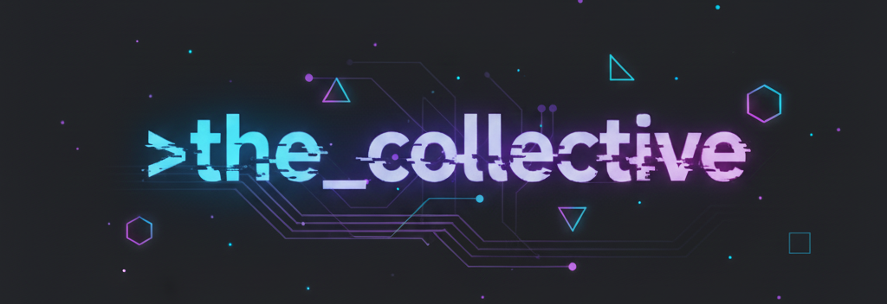

<div align="center" id="the_collective">



[](https://opensource.org/licenses/Apache-2.0)
[](https://code.visualstudio.com/)
[](https://nodejs.org/)
[](https://www.typescriptlang.org/)
[](https://modelcontextprotocol.io/)
  
<h3>vision:// further enable humans to harness the power of AI and bring their ideas to life</h3>

\>the_collective is a team of AI agents that work together inside VS Code. instead of one AI assistant, you get specialised personalities that debate, research, and build things collaboratively using powerful tools. it's like having a full dev team in your editor.

**no AI expertise required:** if you can handle installing vscode and running a single terminal command, you're good to go.

</div>

### ⚡ quick start

#### 🪟 Windows
>\>*if you're not familiar with the command line interface:*

1. Click here to download: [Download ZIP](https://github.com/screamingearth/the_collective/archive/refs/heads/main.zip)
2. Right-click the ZIP file → **Extract All** → choose a folder (e.g., Desktop or Documents)
3. Open the extracted folder → **double-click `setup.bat`** 
4. Do the thing
5. Restart VS Code
6. ????
7. Profit!

##### 🪟 Windows (if you have git)
```powershell
git clone https://github.com/screamingearth/the_collective.git
cd the_collective
.\setup.bat
```

#### 🍎 macOS / Linux
```bash
git clone https://github.com/screamingearth/the_collective.git
cd the_collective
./setup.sh
```

**Note:** If Git isn't installed, the setup script will attempt to install it automatically

#### ✅ Verify Installation
```bash
npm run check  # full health check
```

### 🎉 You're all set!
restart VS Code after setup, open copilot chat with the_collective, 
> hey guys, I'd like to make...

<br>

## 🤖 the team

| agent | role | specialty | vibe |
|-------|------|-----------|------|
| **nyx** | orchestrator | strategy & synthesis | witty, direct, runs the show |
| **prometheus** | builder | implementation & architecture | methodical, technical |
| **cassandra** | breaker | security & risk analysis | skeptical, thorough |
| **apollo** | polisher | optimization & quality | perfectionist, elegant |
<br>

**>the_collective is best utilized by Claude models:**

\>Haiku 4.5 (fast)

\>Sonnet 4.5 (default)

\>Opus 4.5 (deep reasoning)

<h5>but of course, you can use whatever you want!</h5>

<br>

## 🧠 how it works

**memory system** // Local vector database (DuckDB + semantic embeddings) with retriever-reranker pipeline. your preferences, decisions, architectural choices, and project context persist across sessions. encrypted locally, never sent to cloud.

**agents** // One language model, four specialized personas. address them directly in chat (`cassandra, review this`) or use team mode to watch them collaborate in real-time.

**team mode** // Switch to `>the_collective` in Copilot chat. Watch Nyx orchestrate while Prometheus builds, Cassandra breaks things, and Apollo polishes. Friction creates quality.

<br>

## 🚀 features

- **local memory** // semantic vector database never leaves your machine
- **zero tracking** // Apache 2.0 licensed, no telemetry, no vendor lock-in
- **cognitive diversity** // use multiple LLM models for different perspectives
- **real-time collaboration** // watch agents debate, build, and refine solutions
- **extensible architecture** // add custom agents, tools, memories, and workflows
- **dual-licensed** // Apache 2.0 for integration, MPL 2.0 for core framework
- **open-source** // fully transparent, community-driven development

<br>

## 📋 requirements

**core:**
- **VS Code 1.107+** ([download](https://code.visualstudio.com/)) with **GitHub Copilot** subscription or free account
- **macOS, Linux, or Windows**

**recommended:**
- VS Code **Insiders** build for seamless MCP auto-startup
- 4GB+ RAM (MCP servers + vector embeddings)
- 500MB+ disk space (dependencies + memory database)

### VS Code Edition Comparison

| feature | insiders | stable |
|---------|----------|--------|
| **MCP auto-startup** | ✅ automatic | ⚠️ manual (1 task) |
| **Agent defaults** | ✅ immediate | ⚠️ ~1 setup step |
| **Experimental features** | ✅ yes | ✅ stable |
| **Release cycle** | daily | monthly |

<br>

## 📖 documentation

- **[/docs/ (technical jargon)](./docs/)** // architecture, MCP servers, memory system
- **[QUICKSTART.md](./QUICKSTART.md)** // detailed setup & troubleshooting

- **[CHANGELOG.md](./CHANGELOG.md)** // release notes & version history 
- **[CONTRIBUTING.md](./CONTRIBUTING.md)** // development setup, code of conduct, PR guidelines
- **[THIRD_PARTY_LICENSES.md](./THIRD_PARTY_LICENSES.md)** // open-source attributions & licenses
- **[NOTICE](./NOTICE)** // licensing, trademark, and attribution guidelines

<br>

## 🆘 troubleshooting

```bash
npm run check              # full health check
npm run check -- --quick   # fast validation
npm run check -- --memory  # memory system only
```

**logs & diagnostics:**

All setup and check operations are logged to `.collective/.logs/` for troubleshooting:
- `setup.log` — recorded during `./setup.sh`
- `check.log` — recorded during `npm run check`

When reporting issues, include the relevant log file from `.collective/.logs/`.

**common issues:**

| issue | solution |
|-------|----------|
| MCP servers not starting | VS Code Stable: run task "Start MCP Servers" (Ctrl+Shift+P) |
| memory not loading | `cd .collective/memory-server && npm run build && npm run bootstrap` |
| database locked | close VS Code, retry |
| agents not responding | check `npm run check`, ensure Copilot subscription active |
| memory reset needed | `rm .mcp/collective_memory.duckdb* && npm run bootstrap` |

See [QUICKSTART.md](./QUICKSTART.md#troubleshooting) for detailed troubleshooting.

<br>

## 🌐 community & support

- **GitHub Issues** // [report bugs](https://github.com/screamingearth/the_collective/issues/new/choose)
- **Discussions** // [ideas, questions, show your work](https://github.com/screamingearth/the_collective/discussions)
- **Reddit** // [r/vscode](https://reddit.com/r/vscode), [r/githubcopilot](https://reddit.com/r/githubcopilot)
- **Documentation** // start with [QUICKSTART.md](./QUICKSTART.md)
  
<br>

## ⚖️ License & Legal

This project is **Dual-Licensed** to protect the core framework while allowing easy integration.

### 🧠 The Core (MPL 2.0)
The intelligence engine (`/.collective/`) and the Agent Personas (System Prompts) are licensed under the **[Mozilla Public License 2.0](https://www.mozilla.org/en-US/MPL/2.0/)**. 
*   **Commercial Use:** ✅ Allowed.
*   **Modifications:** 📝 If you modify the core framework or agent prompts, you **must** open-source those specific changes and include required documentation.

### 🔌 The Shell (Apache 2.0)
The setup scripts, documentation, and integration code are licensed under the **[Apache License 2.0](https://www.apache.org/licenses/LICENSE-2.0)**.
*   You are free to use, modify, and distribute these scripts as you see fit.

### 🛡️ Attribution

">the_collective" is the name of this framework. The agent names (Nyx, Prometheus, Cassandra, Apollo) are inspired by mythology and are not trademarked - feel free to use those names for your own custom agents. 

What matters: if you use code from this project, respect the licenses (MPL 2.0 for core, Apache 2.0 for integration) and give proper attribution. See [NOTICE](./NOTICE) for details.

### 💼 Commercial use - YES ✅

*you can absolutely sell stuff made with >the_collective*

**allowed:**
- Building a SaaS service powered by >the_collective ✅
- Selling applications that use >the_collective ✅
- Integrating >the_collective into proprietary software ✅

**not allowed:**
- Selling >the_collective itself as your product ❌
- Claiming you created >the_collective agents ❌
- Rebranding and reselling >the_collective as proprietary ❌ 

### 📦 Third-party packages

See [THIRD_PARTY_LICENSES.md](./THIRD_PARTY_LICENSES.md) for all open-source attributions and licenses of dependencies.

## 🤝 contributing

Contributions welcome! See [CONTRIBUTING.md](./CONTRIBUTING.md) for:
- Development setup
- Code of conduct
- PR guidelines
- Issue labels & triage

<br>

<div align="center">
  
built with 🖤 by >the_collective

[⬆ uppies](#the_collective)

</div>
